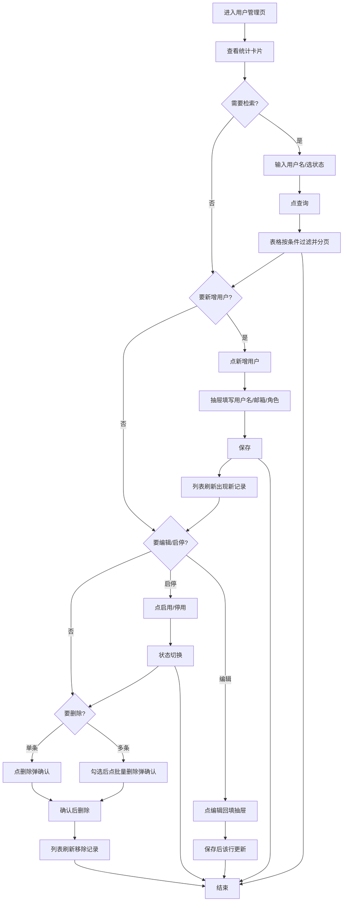

# 交接文档示例（handover 示例）

> 本文是一份**示例文档**，演示 `references/handover.md` 要求的交接文档应长什么样、怎么写。
> 文件名本应等于 tag 名（如 `deliver-用户管理页-20260807-01.md`），这里用通用名是为了当模板复用。
> 内容共五部分：**使用说明（含用户操作流程图）→ DOM 树与组件说明 → 设计与用户体验 → 功能说明 → 对话过程摘要**。
> 本示例以「用户管理页」为例，展示**新增页面**场景；**复刻 demo** 场景格式与要求完全一致，只把 DOM 树描述改成复刻出来的页面即可。

---

## 一、使用说明

本页是**用户管理页**，面向系统管理员，用于在网页上查看、检索、新增、编辑和删除平台用户，并对用户启用/停用账号。

### 使用者操作逻辑

1. 从左侧导航点击「用户管理」进入本页，页面顶部展示用户统计卡片（总用户数、本月新增、启用中、停用）。
2. 中部是搜索区，可按**用户名**关键字模糊搜索、按**状态**下拉筛选；点击「查询」过滤表格，点击「重置」清空条件。
3. 下方是用户列表表格，展示头像、用户名、邮箱、角色、状态、创建时间，右侧为「编辑 / 启用·停用 / 删除」操作列；表格支持**分页**与**批量选择**。
4. 点击右上角「新增用户」打开抽屉表单，填写用户名、邮箱、角色后保存，列表即时刷新并出现新记录。
5. 对单行点「编辑」打开同一抽屉回填数据，保存后该行更新；点「启用/停用」切换状态，被停用的用户不再出现在可用列表。
6. 勾选多行后点「批量删除」，弹确认框，确认后所选记录一并删除。

### 用户操作流程图



---

## 二、DOM 树与组件说明

> 树中缩进表达嵌套层级；每个节点标注对应**当前项目自身的组件**（`src/pages` / `src/components` 下），
> **最底层节点必须是白名单原子组件**（antd / @ant-design/pro-components / @ant-design/x 等清单内组件）。
> 命名约定：`自身组件` 用项目实际文件路径，`原子组件` 标注所属库（如 `antd:Button`）。

```
用户管理页 (src/pages/UserManagement/index.tsx)
├── 统计卡片区
│   └── UserStatCards (src/components/UserStatCards/index.tsx)      # 项目组件：展示四张统计卡片
│       ├── antd:Card        # 原子组件：统计卡片容器
│       │   ├── antd:Statistic          # 数值
│       │   └── antd:Statistic          # 数值
│       ├── antd:Card
│       │   ├── antd:Statistic
│       │   └── antd:Statistic
│       ├── antd:Card
│       │   └── antd:Statistic
│       └── antd:Card
│           └── antd:Statistic
├── 搜索区
│   └── UserSearchBar (src/components/UserSearchBar/index.tsx)      # 项目组件：封装检索条件
│       └── ProForm (src/components/UserSearchBar/query-form.tsx)   # 项目组件：检索表单
│           ├── @ant-design/pro-components:ProFormText   # 用户名关键字
│           ├── @ant-design/pro-components:ProFormSelect # 状态下拉
│           ├── antd:Button(type=primary)                # 查询
│           └── antd:Button                              # 重置
├── 列表区
│   └── UserTable (src/components/UserTable/index.tsx)              # 项目组件：用户列表表格
│       ├── @ant-design/pro-components:ProTable   # 原子组件：承载表格+分页+批量
│       │   ├── antd:Table
│       │   │   ├── antd:Table.Column(头像)        # 用 antd:Avatar 渲染
│       │   │   ├── antd:Table.Column(用户名)
│       │   │   ├── antd:Table.Column(邮箱)
│       │   │   ├── antd:Table.Column(角色)
│       │   │   ├── antd:Table.Column(状态)        # 用 antd:Tag 渲染
│       │   │   ├── antd:Table.Column(创建时间)
│       │   │   └── antd:Table.Column(操作)        # 编辑/启停/删除
│       │   │       ├── antd:Button(编辑)
│       │   │       ├── antd:Button(启用/停用)
│       │   │       └── antd:Button(删除, danger)
│       │   ├── antd:Table.ColumnSelection   # 批量勾选列
│       │   └── antd:Pagination              # 分页器
├── 新增/编辑抽屉
│   └── UserFormDrawer (src/components/UserFormDrawer/index.tsx)    # 项目组件：新增/编辑共用表单抽屉
│       ├── antd:Drawer            # 抽屉容器
│       │   ├── antd:Form          # 表单
│       │   │   ├── antd:Form.Item(用户名)
│       │   │   │   └── antd:Input
│       │   │   ├── antd:Form.Item(邮箱)
│       │   │   │   └── antd:Input
│       │   │   └── antd:Form.Item(角色)
│       │   │       └── antd:Select
│       │   └── antd:Space          # 底部操作按钮
│       │       ├── antd:Button(取消)
│       │       └── antd:Button(保存, type=primary)
└── 删除确认
    └── antd:Popconfirm    # 原子组件：删除前二次确认（单条与批量共用）
        └── antd:Button(确认删除)
```

### 组件归属与职责

| 区块 | 当前项目自身组件 | 归属 | 职责 | 由哪些白名单原子组件拼出 |
|---|---|---|---|---|
| 统计卡片区 | `UserStatCards` | `src/components/` | 汇总展示用户统计 | `antd:Card` + `antd:Statistic` |
| 搜索区 | `UserSearchBar` | `src/components/` | 承载检索条件表单 | `ProFormText` + `ProFormSelect` + `antd:Button` |
| 搜索区 | `query-form` | `src/components/UserSearchBar/` | 检索表单的字段布局 | `ProFormText` + `ProFormSelect` + `antd:Button` |
| 列表区 | `UserTable` | `src/components/` | 用户列表、分页、批量操作 | `ProTable` + `antd:Table` + `antd:Table.Column` + `antd:Pagination` + `antd:Avatar` + `antd:Tag` |
| 新增/编辑 | `UserFormDrawer` | `src/components/` | 新增与编辑共用的表单抽屉 | `antd:Drawer` + `antd:Form` + `antd:Input` + `antd:Select` + `antd:Space` + `antd:Button` |
| 删除确认 | 无独立组件（直接用原子组件） | — | 单条/批量删除的二次确认 | `antd:Popconfirm` |

> **关键约定**：DOM 树的每一棵子树都**终止于白名单原子组件**——`antd`（Button/Card/Table/Form/Input/Select/Drawer/Popconfirm/Statistic/Avatar/Tag/Pagination/Space）、`@ant-design/pro-components`（ProTable/ProFormText/ProFormSelect）、`@ant-design/x`（AI 场景的 Sender/Bubble 等）、`@ant-design/icons`（图标）。项目自身组件（`UserStatCards` 等）只负责组织这些原子组件、提供业务逻辑，**自身不重复造 UI**，因此树的叶子一定是框架原子组件，而不是自定义 DOM。

---

## 三、设计与用户体验（Design & UX）

### 3.1 设计原则 / UX 原则
- 操作路径最短：列表检索、新增、编辑、启停、删除都在同一页完成，不跳页
- 关键操作可撤销：删除前一律弹 `Popconfirm` 二次确认，降低误操作成本
- 状态反馈明确：每个操作都有 loading / 成功 / 失败反馈，不静默
- 参考 Design System：[公司 Design System 链接]

### 3.2 用户流程（User Flow）
- 主流程（Happy Path）：进入用户管理页 → 看统计 → 检索 → 查看列表 → 新增/编辑/启停/删除 → 列表刷新
- 关键分支路径：
  - 路径 A：检索条件过滤后分页浏览
  - 路径 B：新增用户（抽屉表单 → 保存 → 列表新增记录）
  - 路径 C：编辑用户（回填 → 保存 → 该行更新）
  - 路径 D：批量删除（勾选多行 → 确认 → 批量移除）
- 异常/退出路径：表单校验失败留在抽屉并提示；删除取消则无变化；点击抽屉「取消」或关闭图标退出

### 3.3 原型与设计稿
- 交互原型（Figma/Axure）：[原型链接]
- 视觉设计稿（UI）：[设计稿链接]
- 关键页面清单：

| 页面名称 | 说明 | 设计稿链接/截图 |
|----------|------|-----------------|
| 用户管理页 | 列表 + 检索 + 统计 + 新增编辑抽屉 | [截图/链接] |

### 3.4 关键交互说明
- 导航方式：左侧菜单「用户管理」进入；页内顶部为统计卡片、中部检索、下方列表
- 手势/操作约定（移动端）：点击行右侧按钮展开操作；批量操作用表格行首勾选框
- 动画与反馈要求：抽屉从右侧滑入；删除确认用气泡 `Popconfirm`；保存成功 `message.success`

### 3.5 全局状态与边界处理

| 状态类型 | 表现要求 | 备注 |
|----------|----------|------|
| 加载中（Loading） | 表格 `ProTable` loading 态、按钮 loading | 检索/分页时列表转圈 |
| 空状态（Empty） | 文案「暂无用户」+ 「新增用户」引导按钮 | 无数据时展示 |
| 错误状态（Error） | 明确错误原因 + 重试按钮 | 列表加载失败时展示 |
| 无权限 | 提示文案 + 申请权限/返回入口 | 角色受限时展示 |
| 网络异常 | 提示网络异常 + 重试 | 请求失败时展示 |

---

## 四、功能说明

### 功能名称：用户检索

#### 1. 功能目标
管理员能按条件快速定位目标用户，解决用户量大时找不到人的问题。

#### 2. 用户场景 / 用户故事
作为系统管理员，我希望按用户名和状态筛选用户，以便快速找到并处理指定账号。

#### 3. 页面/界面说明
- 入口：用户管理页中部搜索区
- 布局说明：
  - 顶部：统计卡片
  - 主体：搜索表单 + 用户列表表格
  - 底部操作区：分页器

#### 4. 交互与操作流程
1. 在搜索区输入用户名关键字、选择状态下拉
2. 点击「查询」，表格按条件过滤并回到第一页
3. 点击「重置」清空条件并恢复全量列表

#### 5. 字段规则

| 字段名 | 类型 | 是否必填 | 校验规则 | 默认值 | 错误提示文案 | 备注 |
|--------|------|----------|----------|--------|--------------|------|
| 用户名 | 输入框 | 否 | 关键字模糊匹配 | 无 | — | 留空即不过滤 |
| 状态 | 下拉 | 否 | 枚举：启用/停用 | 全部 | — | 全选即不过滤 |

#### 6. 各种状态表现
- **正常态**：表单可编辑，点击查询生效
- **加载态**：表格 loading，防重复点击
- **成功态**：列表刷新展示过滤结果
- **失败态**：Toast 提示错误原因
- **空态**：无匹配数据显示「暂无用户」
- **权限不足**：无权限时隐藏检索入口

#### 7. 异常与边界场景
- 关键字含特殊字符（按普通字符串处理）
- 无匹配结果（展示空态）
- 网络超时（提示 + 重试）

#### 8. 验收标准（可测试）
- [ ] 按用户名/状态检索可正确过滤列表
- [ ] 重置可恢复全量列表
- [ ] 空态、加载态、错误态均有明确反馈
- [ ] 桌面端与移动端表现符合设计稿

---

### 功能名称：新增 / 编辑用户

#### 1. 功能目标
管理员能创建新用户或修改既有用户信息。

#### 2. 用户场景 / 用户故事
作为系统管理员，我希望新增或编辑用户资料，以便维护账号信息。

#### 3. 页面/界面说明
- 入口：列表右上角「新增用户」按钮，或单行「编辑」按钮
- 布局说明：右侧抽屉表单（用户名、邮箱、角色），底部「取消 / 保存」

#### 4. 交互与操作流程
1. 点「新增用户」打开空抽屉，或点「编辑」打开回填数据的抽屉
2. 填写/修改字段
3. 点「保存」→ 校验通过后提交，`message.success` 提示成功，抽屉关闭、列表刷新
4. 点「取消」或关闭图标退出，不保存

#### 5. 字段规则

| 字段名 | 类型 | 是否必填 | 校验规则 | 默认值 | 错误提示文案 | 备注 |
|--------|------|----------|----------|--------|--------------|------|
| 用户名 | 输入框 | 是 | 2-20 位，不能重复 | 无 | 「请输入用户名」「用户名已存在」 | 编辑时不可改 |
| 邮箱 | 输入框 | 是 | 合法邮箱格式 | 无 | 「请输入正确的邮箱」 | — |
| 角色 | 下拉 | 是 | 枚举：管理员/运营/只读 | 运营 | 「请选择角色」 | — |

#### 6. 各种状态表现
- **正常态**：抽屉表单可填写
- **加载态**：保存按钮 loading，不可重复点击
- **成功态**：Toast「操作成功」+ 抽屉关闭 + 列表刷新
- **失败态**：提示错误原因，保留已填内容
- **空态**：—（表单无空态）
- **权限不足**：无权限时隐藏新增/编辑入口

#### 7. 异常与边界场景
- 必填未填
- 邮箱格式错误
- 用户名重复
- 网络超时
- 重复提交（loading 防抖）

#### 8. 验收标准（可测试）
- [ ] 新增/编辑后列表正确刷新
- [ ] 所有校验与错误提示正确且位置合理
- [ ] 保存中按钮 loading 防重复提交
- [ ] 加载/成功/失败状态均有明确反馈

---

### 功能名称：删除用户

#### 1. 功能目标
管理员能删除单条或批量删除用户。

#### 2. 用户场景 / 用户故事
作为系统管理员，我希望删除无效用户，以便保持账号列表干净。

#### 3. 页面/界面说明
- 入口：单行「删除」按钮，或勾选多行后的「批量删除」

#### 4. 交互与操作流程
1. 点「删除」或勾选后点「批量删除」
2. 弹出 `Popconfirm` 确认框
3. 确认后删除，`message.success` 提示，列表刷新移除记录；取消则无变化

#### 5. 字段规则
- 无字段输入，仅二次确认

#### 6. 各种状态表现
- **正常态**：删除按钮可用（danger 样式）
- **加载态**：确认按钮 loading
- **成功态**：Toast「删除成功」+ 列表刷新
- **失败态**：提示错误原因
- **空态**：无可删数据时批量删除按钮禁用
- **权限不足**：无权限时隐藏删除按钮

#### 7. 异常与边界场景
- 未勾选任何行点批量删除（按钮禁用）
- 删除时网络超时
- 删除失败（提示原因）

#### 8. 验收标准（可测试）
- [ ] 单条/批量删除均需二次确认
- [ ] 删除后列表正确移除记录
- [ ] 未勾选时批量删除禁用
- [ ] 加载/成功/失败状态均有明确反馈

---

## 五、对话过程摘要

1. **原始需求**（产品经理）：做一个用户管理页 demo，给运营演示用，要有用户列表、能搜索、能新增编辑删除。
2. **第一轮反馈**：列表太简单，希望顶部加统计卡片，让演示时先看整体数据。
   - 修改：新增 `UserStatCards` 组件，用四张 `Card + Statistic` 展示总用户/本月新增/启用/停用。
3. **第二轮反馈**：搜索只有用户名不够，要能按状态筛选；删除要防误点。
   - 修改：搜索区增加状态下拉（`ProFormSelect`），操作列删除与批量删除都包 `Popconfirm` 二次确认。
4. **第三轮反馈**：新增和编辑都想要抽屉式表单，别跳页。
   - 修改：把新增/编辑抽成共用的 `UserFormDrawer` 抽屉，编辑时回填当前行数据。
5. **确认满意**：演示过一遍后确认可以，打 tag `deliver-用户管理页-20260814-01` 并生成本文档。
