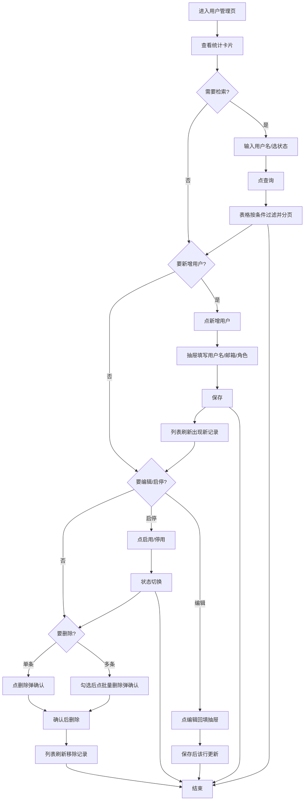

# 交接文档示例（handover 示例）

> 本文是一份**示例文档**，演示 `references/handover.md` 要求的交接文档应长什么样、怎么写。
> 文件名本应等于 tag 名（如 `deliver-用户管理页-20260807-01.md`），这里用通用名是为了当模板复用。
> 内容仅三部分：**使用说明（含用户操作流程图）→ DOM 树与组件说明 → 对话过程摘要**。
> 本示例以「用户管理页」为例，展示**新增页面**场景；**复刻 demo** 场景格式与要求完全一致，只把 DOM 树描述改成复刻出来的页面即可。

---

## 一、使用说明

本页是**用户管理页**，面向系统管理员，用于在网页上查看、检索、新增、编辑和删除平台用户，并对用户启用/停用账号。

### 使用者操作逻辑

1. 从左侧导航点击「用户管理」进入本页，页面顶部展示用户统计卡片（总用户数、本月新增、启用中、停用）。
2. 中部是搜索区，可按**用户名**关键字模糊搜索、按**状态**下拉筛选；点击「查询」过滤表格，点击「重置」清空条件。
3. 下方是用户列表表格，展示头像、用户名、邮箱、角色、状态、创建时间，右侧为「编辑 / 启用·停用 / 删除」操作列；表格支持**分页**与**批量选择**。
4. 点击右上角「新增用户」打开抽屉表单，填写用户名、邮箱、角色后保存，列表即时刷新并出现新记录。
5. 对单行点「编辑」打开同一抽屉回填数据，保存后该行更新；点「启用/停用」切换状态，被停用的用户不再出现在可用列表。
6. 勾选多行后点「批量删除」，弹确认框，确认后所选记录一并删除。

### 用户操作流程图



---

## 二、DOM 树与组件说明

> 树中缩进表达嵌套层级；每个节点标注对应**当前项目自身的组件**（`src/pages` / `src/components` 下），
> **最底层节点必须是白名单原子组件**（antd / @ant-design/pro-components / @ant-design/x 等清单内组件）。
> 命名约定：`自身组件` 用项目实际文件路径，`原子组件` 标注所属库（如 `antd:Button`）。

```
用户管理页 (src/pages/UserManagement/index.tsx)
├── 统计卡片区
│   └── UserStatCards (src/components/UserStatCards/index.tsx)      # 项目组件：展示四张统计卡片
│       ├── antd:Card        # 原子组件：统计卡片容器
│       │   ├── antd:Statistic          # 数值
│       │   └── antd:Statistic          # 数值
│       ├── antd:Card
│       │   ├── antd:Statistic
│       │   └── antd:Statistic
│       ├── antd:Card
│       │   └── antd:Statistic
│       └── antd:Card
│           └── antd:Statistic
├── 搜索区
│   └── UserSearchBar (src/components/UserSearchBar/index.tsx)      # 项目组件：封装检索条件
│       └── ProForm (src/components/UserSearchBar/query-form.tsx)   # 项目组件：检索表单
│           ├── @ant-design/pro-components:ProFormText   # 用户名关键字
│           ├── @ant-design/pro-components:ProFormSelect # 状态下拉
│           ├── antd:Button(type=primary)                # 查询
│           └── antd:Button                              # 重置
├── 列表区
│   └── UserTable (src/components/UserTable/index.tsx)              # 项目组件：用户列表表格
│       ├── @ant-design/pro-components:ProTable   # 原子组件：承载表格+分页+批量
│       │   ├── antd:Table
│       │   │   ├── antd:Table.Column(头像)        # 用 antd:Avatar 渲染
│       │   │   ├── antd:Table.Column(用户名)
│       │   │   ├── antd:Table.Column(邮箱)
│       │   │   ├── antd:Table.Column(角色)
│       │   │   ├── antd:Table.Column(状态)        # 用 antd:Tag 渲染
│       │   │   ├── antd:Table.Column(创建时间)
│       │   │   └── antd:Table.Column(操作)        # 编辑/启停/删除
│       │   │       ├── antd:Button(编辑)
│       │   │       ├── antd:Button(启用/停用)
│       │   │       └── antd:Button(删除, danger)
│       │   ├── antd:Table.ColumnSelection   # 批量勾选列
│       │   └── antd:Pagination              # 分页器
├── 新增/编辑抽屉
│   └── UserFormDrawer (src/components/UserFormDrawer/index.tsx)    # 项目组件：新增/编辑共用表单抽屉
│       ├── antd:Drawer            # 抽屉容器
│       │   ├── antd:Form          # 表单
│       │   │   ├── antd:Form.Item(用户名)
│       │   │   │   └── antd:Input
│       │   │   ├── antd:Form.Item(邮箱)
│       │   │   │   └── antd:Input
│       │   │   └── antd:Form.Item(角色)
│       │   │       └── antd:Select
│       │   └── antd:Space          # 底部操作按钮
│       │       ├── antd:Button(取消)
│       │       └── antd:Button(保存, type=primary)
└── 删除确认
    └── antd:Popconfirm    # 原子组件：删除前二次确认（单条与批量共用）
        └── antd:Button(确认删除)
```

### 组件归属与职责

| 区块 | 当前项目自身组件 | 归属 | 职责 | 由哪些白名单原子组件拼出 |
|---|---|---|---|---|
| 统计卡片区 | `UserStatCards` | `src/components/` | 汇总展示用户统计 | `antd:Card` + `antd:Statistic` |
| 搜索区 | `UserSearchBar` | `src/components/` | 承载检索条件表单 | `ProFormText` + `ProFormSelect` + `antd:Button` |
| 搜索区 | `query-form` | `src/components/UserSearchBar/` | 检索表单的字段布局 | `ProFormText` + `ProFormSelect` + `antd:Button` |
| 列表区 | `UserTable` | `src/components/` | 用户列表、分页、批量操作 | `ProTable` + `antd:Table` + `antd:Table.Column` + `antd:Pagination` + `antd:Avatar` + `antd:Tag` |
| 新增/编辑 | `UserFormDrawer` | `src/components/` | 新增与编辑共用的表单抽屉 | `antd:Drawer` + `antd:Form` + `antd:Input` + `antd:Select` + `antd:Space` + `antd:Button` |
| 删除确认 | 无独立组件（直接用原子组件） | — | 单条/批量删除的二次确认 | `antd:Popconfirm` |

> **关键约定**：DOM 树的每一棵子树都**终止于白名单原子组件**——`antd`（Button/Card/Table/Form/Input/Select/Drawer/Popconfirm/Statistic/Avatar/Tag/Pagination/Space）、`@ant-design/pro-components`（ProTable/ProFormText/ProFormSelect）、`@ant-design/x`（AI 场景的 Sender/Bubble 等）、`@ant-design/icons`（图标）。项目自身组件（`UserStatCards` 等）只负责组织这些原子组件、提供业务逻辑，**自身不重复造 UI**，因此树的叶子一定是框架原子组件，而不是自定义 DOM。

---

## 三、对话过程摘要

1. **原始需求**（产品经理）：做一个用户管理页 demo，给运营演示用，要有用户列表、能搜索、能新增编辑删除。
2. **第一轮反馈**：列表太简单，希望顶部加统计卡片，让演示时先看整体数据。
   - 修改：新增 `UserStatCards` 组件，用四张 `Card + Statistic` 展示总用户/本月新增/启用/停用。
3. **第二轮反馈**：搜索只有用户名不够，要能按状态筛选；删除要防误点。
   - 修改：搜索区增加状态下拉（`ProFormSelect`），操作列删除与批量删除都包 `Popconfirm` 二次确认。
4. **第三轮反馈**：新增和编辑都想要抽屉式表单，别跳页。
   - 修改：把新增/编辑抽成共用的 `UserFormDrawer` 抽屉，编辑时回填当前行数据。
5. **确认满意**：演示过一遍后确认可以，打 tag `deliver-用户管理页-20260814-01` 并生成本文档。
