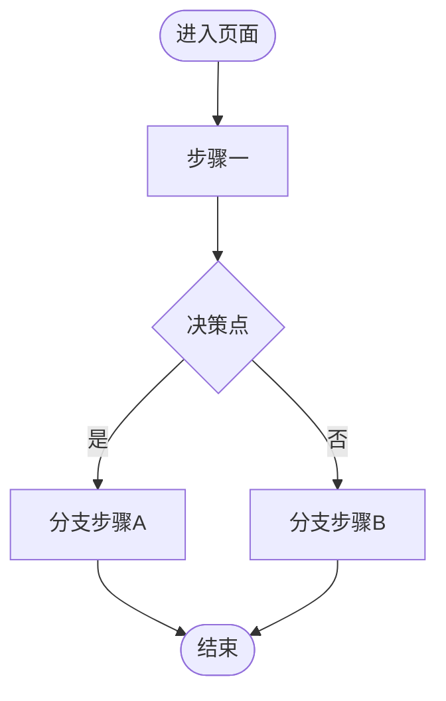

# 交接文档模板（handover template）

> **本文件是生成交接文档的固定模板，不是规范说明。** 生成 `docs/handover/<tag名>.md` 时**以此文件为骨架逐字照抄**，把占位符替换为本次交付的实际内容。
> 文件结构固定为**五个一级章节**（使用说明 / DOM 树与组件说明 / 设计与用户体验 / 功能说明 / 对话过程摘要），**一个都不能少、不能改名、不能增删顺序**。
> **一份文档只写一个页面**：多页面交付时，每个页面各套一份本模板、生成各自 tag 的文档（细则见 `references/handover.md` 的「多页面交付：按页面拆分」）；同一页面内的多个功能，在「四、功能说明」复制多份用例结构。
> 「功能说明」一节对**每个功能**预置了完整用例字段（0–8），每个功能都必须填全，不能省略任何一条。
> 生成后必须运行自检脚本 `scripts/validate-handover.mjs docs/handover/<tag名>.md`，任一检查项不通过不得向用户报告完成。
> 章节写作细则与反问澄清要求见 `references/handover.md`；用例方法论见 `references/use-cases.md`；Mermaid 语法见 `references/mermaid.md`。

---

# 一、使用说明

<!--
  写使用说明前，凡是有不明确、含糊或缺失信息的地方（页面能做什么、操作路径、边界/异常、给谁用等），
  必须向产品经理反问澄清，得到明确结论后方可撰写——不得自行假设或脑补页面行为，问清前不写这部分内容。
-->

本页是**<页面名称>**，面向<目标使用者>，用于<一句话说明页面用途>。

### 使用者操作逻辑

1. <第 1 步操作：从哪进入、点什么、发生什么>
2. <第 2 步操作>
3. <第 3 步操作>
4. <……直到完成目标>

### 用户操作流程图



---

# 二、DOM 树与组件说明

<!--
  用缩进/树状列出页面各区块的嵌套层级；每个节点标注对应当前项目自身组件（src/pages、src/components 下的组件）。
  树的每一棵子树都必须终止于白名单原子组件（antd / @ant-design/pro-components / @ant-design/x / @ant-design/icons 等清单内组件），
  项目自身组件只负责组合原子组件、承载业务逻辑，不能成为 DOM 树的叶子。
-->

```
<页面名> (src/pages/<页面组件>/index.tsx)
├── <区块一>
│   └── <项目组件A> (src/components/<组件A>/index.tsx)      # 项目组件：<职责>
│       ├── <库>:<原子组件>        # 原子组件：<说明>
│       ├── <库>:<原子组件>
│       └── <库>:<原子组件>
├── <区块二>
│   └── <项目组件B> (src/components/<组件B>/index.tsx)      # 项目组件：<职责>
│       └── <库>:<原子组件>
└── <区块三>
    └── <库>:<原子组件>            # 无独立项目组件时直接用原子组件
```

### 组件归属与职责

| 区块 | 当前项目自身组件 | 归属 | 职责 | 由哪些白名单原子组件拼出 |
|---|---|---|---|---|
| <区块一> | `<项目组件A>` | `src/components/` | <职责> | `<库>:<原子组件>` + `<库>:<原子组件>` |
| <区块二> | `<项目组件B>` | `src/components/` | <职责> | `<库>:<原子组件>` |
| <区块三> | 无独立组件 | — | <说明> | `<库>:<原子组件>` |

---

# 三、设计与用户体验（Design & UX）

### 3.1 设计原则 / UX 原则
- <设计原则一，如「操作路径最短」>
- <设计原则二，如「关键操作可撤销」>
- <设计原则三，如「状态反馈明确」>
- 参考 Design System：[公司 Design System 链接]

### 3.2 用户流程（User Flow）
<!-- 主流程用文字或 Mermaid 描述「开始 → 步骤 → 决策点 → 结束」，并列关键分支与异常/退出路径 -->
- 主流程（Happy Path）：<开始 → 步骤 → 结束>
- 关键分支路径：
  - 路径 A：<分支说明>
  - 路径 B：<分支说明>
- 异常/退出路径：<异常/退出说明>

### 3.3 原型与设计稿
- 交互原型（Figma/Axure）：[原型链接]
- 视觉设计稿（UI）：[设计稿链接]
- 关键页面清单：

| 页面名称 | 说明 | 设计稿链接/截图 |
|----------|------|-----------------|
| <页面名称> | <说明> | [截图/链接] |

### 3.4 关键交互说明
- 导航方式：<如何进入/页内导航>
- 手势/操作约定（移动端）：<点击/长按/滑动等>
- 动画与反馈要求：<动画、Toast、loading 等>

### 3.5 全局状态与边界处理

| 状态类型 | 表现要求 | 备注 |
|----------|----------|------|
| 加载中（Loading） | <Skeleton / 转圈 / 按钮 loading> | <说明> |
| 空状态（Empty） | <文案 + 引导操作按钮> | <说明> |
| 错误状态（Error） | <明确错误原因 + 重试/返回入口> | <说明> |
| 无权限 | <提示文案 + 申请权限/返回入口> | <说明> |
| 网络异常 | <提示网络异常 + 重试> | <说明> |

---

# 四、功能说明

<!-- 对页面里每个功能，当作一个用例来写。功能有几个，就复制几份下面的完整结构（0–8 全都要有）。 -->

## 功能名称：<功能名称>（<用例编号，如 UC-XXX-01>）

### 0. 用例概述
| 字段 | 值 |
|---|---|
| 用例名称 | <功能名称> |
| 用例编号 | <UC-XXX-01> |
| 参与者 | <游客/已登录用户/管理员等> |
| 优先级 | <P0/P1/P2> |
| 前置条件 | <用例开始前必须满足的状态> |
| 后置条件 | <成功结束后系统达到的状态> |
| 触发事件 | <用户或系统触发本用例的动作> |

### 1. 功能目标
<用户能完成什么、解决什么问题>

### 2. 用户场景 / 用户故事
作为<角色>，我希望<动作>，以便<价值>。

### 3. 页面/界面说明
- 入口：<从哪里进入>
- 布局说明：<顶部 / 主体 / 底部操作区>

### 4. 正常流程（交互与操作流程）
1. <第 1 步：动作 + 系统反馈>
2. <第 2 步：动作 + 系统反馈>
3. <……>

### 5. 业务规则（字段规则）
| 字段名 | 类型 | 是否必填 | 校验规则 | 默认值 | 错误提示文案 | 备注 |
|--------|------|----------|----------|--------|--------------|------|
| <字段名> | <输入框/下拉/……> | <是/否> | <校验规则> | <默认值> | <错误提示文案> | <备注> |
| <字段名> | <……> | <是/否> | <……> | <……> | <……> | <……> |

- <可测试硬性规则：敏感词脱敏 / 防重复发布 / 防暴力破解 / 长度格式限制等>
- <涉及产品决策但未确认的，如实标注「需产品确认」，不擅自假定>

### 6. 各种状态表现
- **正常态**：<正常可操作的样子>
- **加载态**：<按钮 loading、不可重复点击>
- **成功态**：<Toast「操作成功」+ 刷新或跳转>
- **失败态**：<提示原因 + 保留已填内容>
- **空态**：<无数据时的表现>
- **权限不足**：<无权限时的表现>

### 7. 异常流程（异常与边界场景）
| 编号 | 触发操作 | 系统表现 | 处理结果 |
|---|---|---|---|
| <A1> | <触发操作> | <系统表现> | <处理结果> |
| <A2> | <触发操作> | <系统表现> | <处理结果> |
| <……> | <……> | <……> | <……> |

### 8. 验收标准（可测试）
- [ ] <可测的验收标准一>
- [ ] <可测的验收标准二>
- [ ] <……>

---

# 五、对话过程摘要

1. **原始需求**（产品经理）：<原始需求描述>
2. **第一轮反馈**：<反馈内容>。
   - 修改：<改了什么、为什么改>。
3. **第二轮反馈**：<反馈内容>。
   - 修改：<改了什么、为什么改>。
4. **确认满意**：<演示确认过程>，打 tag `<tag名>` 并生成本文档。
